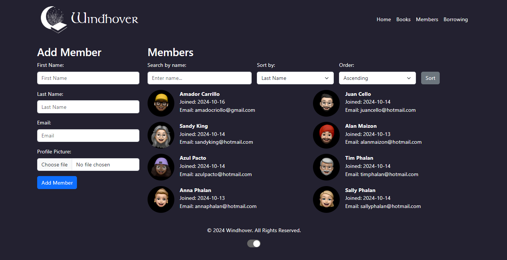

# Module 4 - UCD PA - Alan Maizon

# Windhover Library Management System

Welcome to the **Windhover Library Management System**, a web application where you can browse books, manage member information, and track borrowing history.

## Table of Contents

- [Features](#features)
- [Technologies](#technologies)
- [Setup](#setup)
- [Usage](#usage)
- [Screenshots](#screenshots)
- [License](#license)

## Features

- Browse and search books by title, genre, author, etc.
- Add, edit, and delete book entries.
- Manage members: add new members, search by name, and display member details.
- Track book borrowing history with due dates, borrowing dates, and return tracking.
- Sort data dynamically using search bars and dropdown options.
  
## Technologies

- **Flask**: Python web framework
- **PostgreSQL**: Database for storing books, members, and borrowing records
- **HTML/CSS/JavaScript**: Frontend of the app
- **Bootstrap**: Styling framework for responsive design
- **Psycopg2**: PostgreSQL database adapter for Python
- **Werkzeug**: Utility library used for secure file handling

## Setup

### Prerequisites

Ensure you have the following installed:

- **Python 3.7+**
- **PostgreSQL**

### Installation

1. Clone this repository:

   ```bash
   git clone https://github.com/alanmaizon/windhover.git
   cd windhover
   ```

2. Install the required dependencies:

   ```bash
   pip install -r requirements.txt
   ```

3. Set up the PostgreSQL database:

   - Create a database named `library_db`.
   - Restore the database schema from the provided `.sql` file.
   
   ```bash
   psql -U postgres -d library_db -f schema.sql
   ```

4. Set environment variables for the app (optional):

   ```bash
   export FLASK_APP=app.py
   export FLASK_ENV=development
   ```

5. Run the app:

   ```bash
   flask run
   ```

6. Visit the app in your browser at `http://127.0.0.1:5000`.

### Configuration

Modify `app.py` to set your PostgreSQL connection details:

```python
def get_db_connection():
    conn = psycopg2.connect(
        host='localhost',
        database='library_db',
        user='your_postgres_username',
        password='your_postgres_password'
    )
    return conn
```

## Usage

### Book Management

- View a list of all books.
- Add new books, including uploading cover images.
- Edit and delete existing books.
  
### Member Management

- View and search member details.
- Add new members and upload profile pictures.

### Borrowing System

- Track borrowing and return of books.
- View history of borrowed books with due and return dates.

## Screenshots




