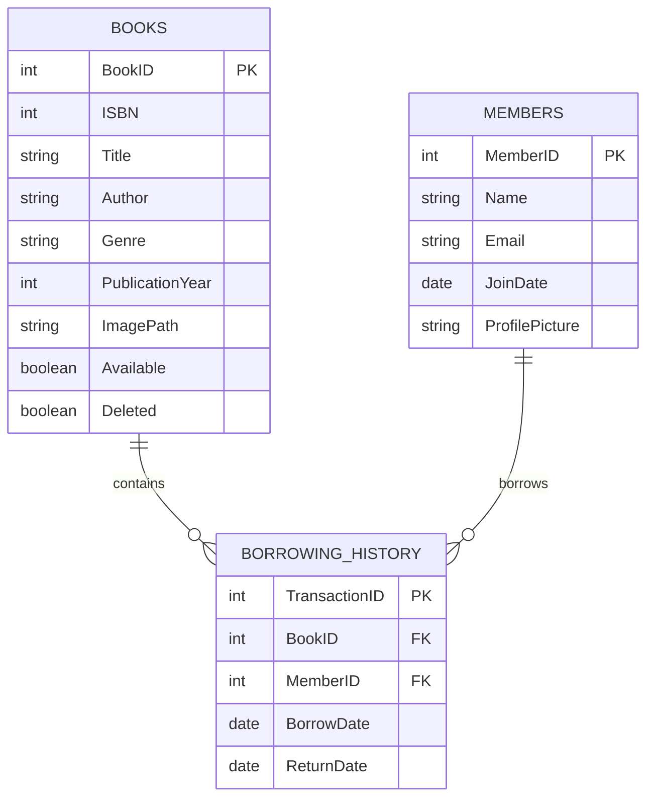

# Module 4 - UCD PA - Alan Maizon

# Windhover Library Management System

Welcome to the **Windhover Library Management System**, a web application where you can browse books, manage member information, and track borrowing history.

## Table of Contents

- [Features](#features)
- [Technologies](#technologies)
- [Setup](#setup)
- [Usage](#usage)
- [Screenshots](#screenshots)

### **Entity-Relationship Diagram (ERD)**:
The project can have three core tables:
- **Books**: 
  - `BookID`, `Title`, `Author`, `Genre`, `PublicationYear`, `ImagePath`
- **Members**: 
  - `MemberID`, `Name`, `Email`, `MembershipStartDate`
- **BorrowingHistory**: 
  - `TransactionID`, `BookID` (foreign key), `MemberID` (foreign key), `BorrowDate`, `ReturnDate`

## Features

- Browse and search books by title, genre, author, etc.
- Add, edit, and delete book entries.
- Manage members: add new members, search by name, display and edit member details.
- Track book borrowing history with due dates, borrowing dates, and return tracking.
- Sort data dynamically using search bars and dropdown options.

## Technologies and Resources

- **Flask**: Python web framework
- **PostgreSQL**: Database for storing books, members, and borrowing records
- **HTML/CSS/JavaScript**: Frontend of the app
- **Bootstrap**: Styling framework for responsive design
- **Psycopg2**: PostgreSQL database adapter for Python
- **SQLAlchemy**: ORM that provides more security and abstraction
- **Werkzeug**: Utility library used for secure file handling
- **Flask-Migrations**: To track and apply incremental changes to the database
- **Blueprints**: Helps organize the app into modular components
- **RDS Amazon AWS**: Database setup, storage, backups, and updates

## Setup

Our goal is to provide data consistency between different routes and database operations handling errors and exceptions.

### Prerequisites

Ensure you have the following installed:

- **Python 3.7+**
- **PostgreSQL**

## Usage

### Book Management

- View a list of all books.
- Add new books, including uploading cover images.
- Edit and delete existing books.

### Member Management

- View and search member details.
- Add new members and upload profile pictures.
- Edit existing members.

### Borrowing System

- Track borrowing and return of books.
- View history of borrowed books with due and return dates.
- See live trends and stats.

## Screenshots

