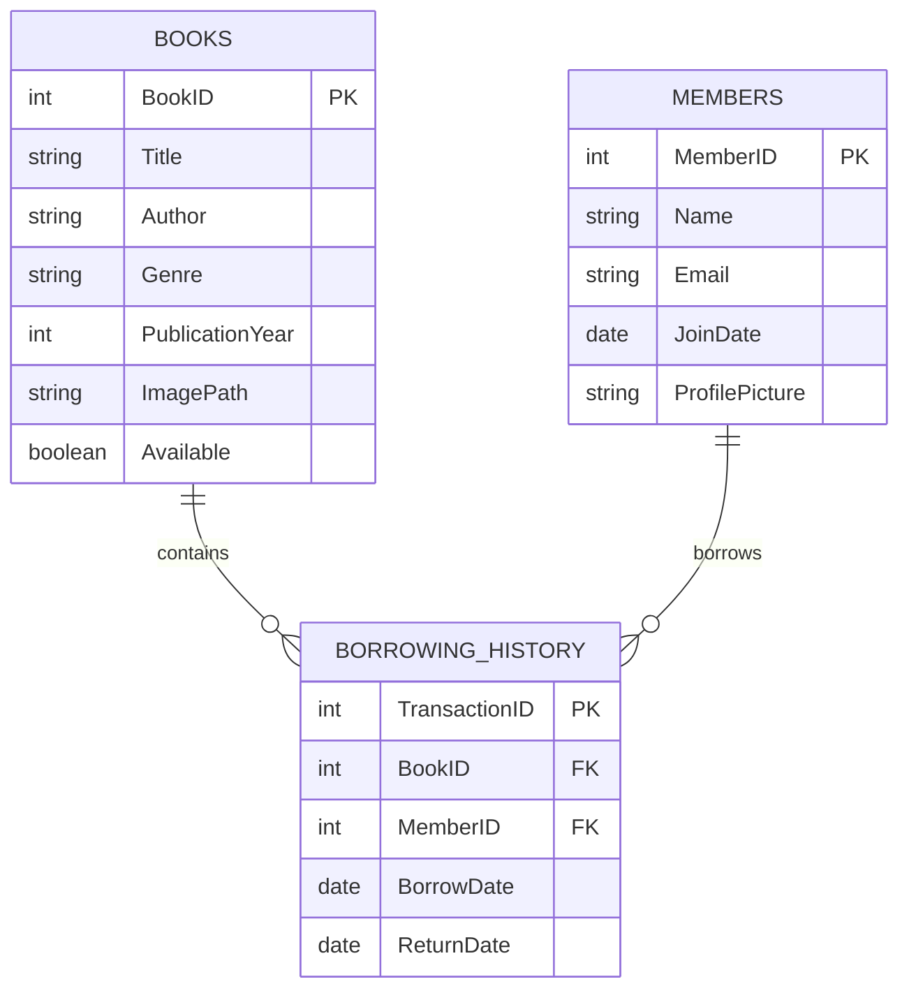
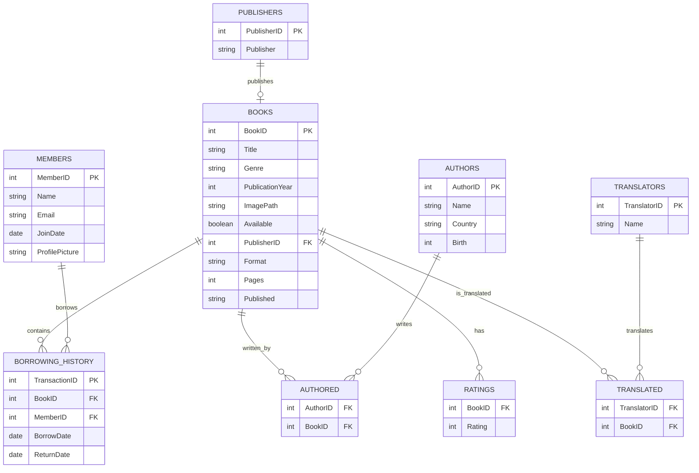

# ERD - Simplified schema BOOKS - MEMBERS

```mermaid
erDiagram
    BOOKS {
        int BookID PK
        string Title
        string Author
        string Genre
        int PublicationYear
        string ImagePath
        boolean Available
    }

    MEMBERS {
        int MemberID PK
        string Name
        string Email
        date JoinDate
        string ProfilePicture
    }

    BORROWING_HISTORY {
        int TransactionID PK
        int BookID FK
        int MemberID FK
        date BorrowDate
        date ReturnDate
    }

    BOOKS ||--o{ BORROWING_HISTORY: contains
    MEMBERS ||--o{ BORROWING_HISTORY: borrows
```

# ERD - Expanded BOOKS schema

```mermaid
erDiagram
    BOOKS {
        int BookID PK
        string Title
        string Genre
        int PublicationYear
        string ImagePath
        boolean Available
        int PublisherID FK
        string Format
        int Pages
        string Published
    }

    AUTHORS {
        int AuthorID PK
        string Name
        string Country
        int Birth
    }

    PUBLISHERS {
        int PublisherID PK
        string Publisher
    }

    AUTHORED {
        int AuthorID FK
        int BookID FK
    }

    RATINGS {
        int BookID FK
        int Rating
    }

    TRANSLATORS {
        int TranslatorID PK
        string Name
    }

    TRANSLATED {
        int TranslatorID FK
        int BookID FK
    }

    MEMBERS {
        int MemberID PK
        string Name
        string Email
        date JoinDate
        string ProfilePicture
    }

    BORROWING_HISTORY {
        int TransactionID PK
        int BookID FK
        int MemberID FK
        date BorrowDate
        date ReturnDate
    }

    BOOKS ||--o{ BORROWING_HISTORY: contains
    MEMBERS ||--o{ BORROWING_HISTORY: borrows
    BOOKS ||--o{ AUTHORED: written_by
    AUTHORS ||--o{ AUTHORED: writes
    BOOKS ||--o{ RATINGS: has
    PUBLISHERS ||--o| BOOKS: publishes
    BOOKS ||--o{ TRANSLATED: is_translated
    TRANSLATORS ||--o{ TRANSLATED: translates

```

